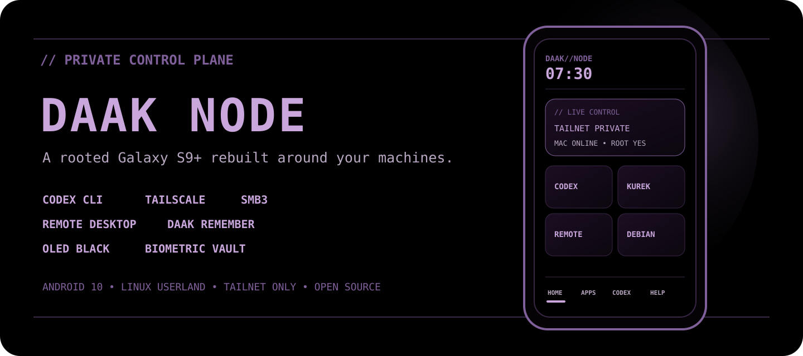
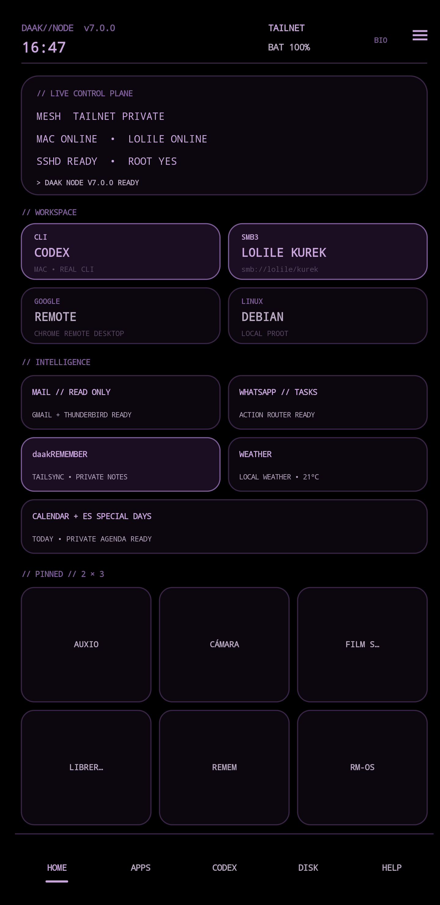
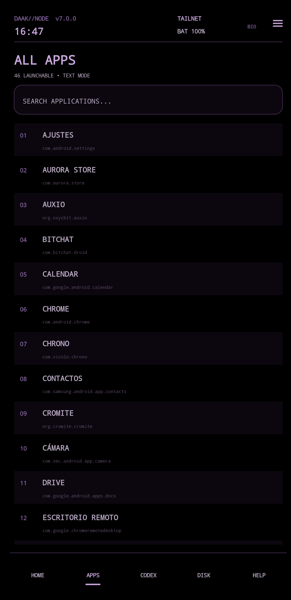
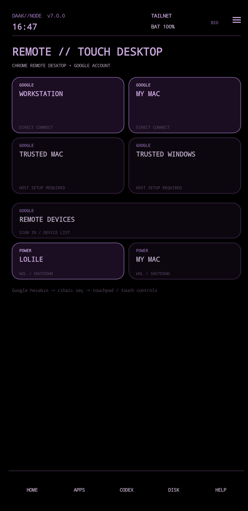
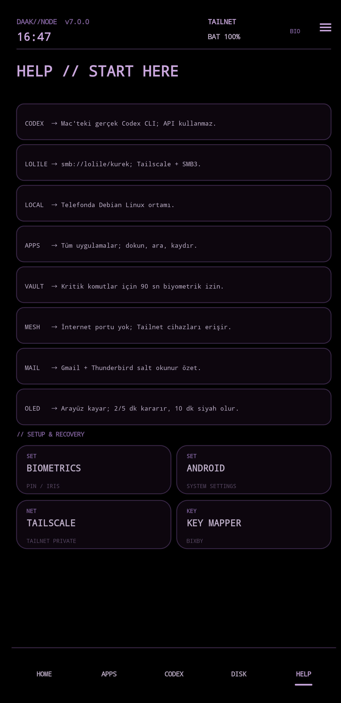
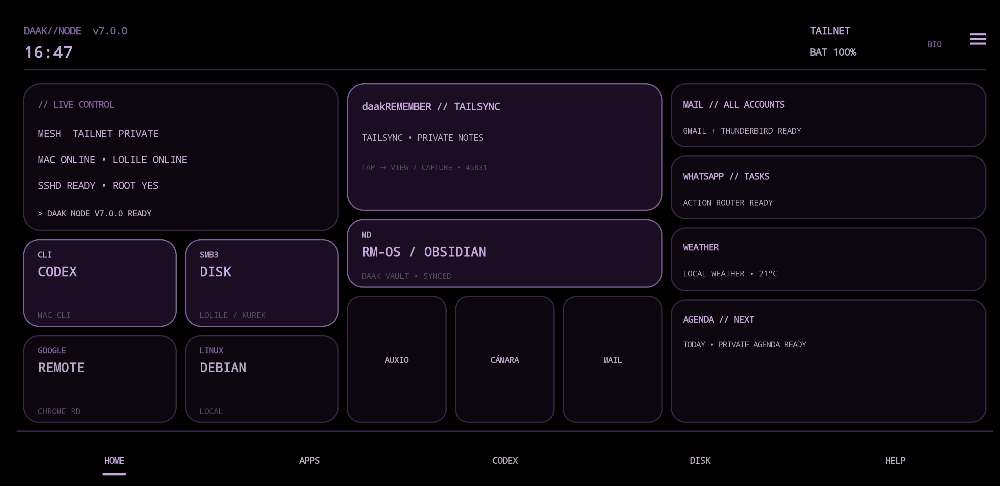

# DAAK NODE

<p align="center">
  
</p>

<p align="center">
  <a href="https://github.com/benfirad/daak-node/releases/latest"></a>
  
  
  
</p>

DAAK NODE is a true-black, Linux-flavoured Android launcher and private control plane. It was built for a rooted Samsung Galaxy S9+ running Android 10, while keeping Android as the hardware-compatibility layer for the camera, modem, fingerprint sensor and iris scanner.

## The interface

These are real screenshots from the SM-G965F. Public showcase mode replaces private Tailnet addresses, mail subjects, WhatsApp tasks, notes, weather location and agenda entries with neutral demo copy.

<p align="center">
  
  
  
  
</p>

<p align="center">
  
</p>

| Surface | What it does |
| --- | --- |
| **HOME** | Live Tailnet, Codex, Kurek, mail, tasks, notes, weather and agenda status |
| **APPS** | Searchable, text-first launcher without icon-grid clutter |
| **CODEX** | Biometric-gated access to the real Codex CLI running on the Mac |
| **DISK** | SMB3 browse, private inline preview and explicit offline download |
| **REMOTE** | Direct Chrome Remote Desktop routes plus guarded wake/shutdown controls |
| **HELP** | On-device explanations and recovery shortcuts for every critical subsystem |

## Highlights

- OLED-black launcher with pixel shifting and an immersive, gesture-friendly dock
- Twenty-five-position OLED pixel orbit plus 2/5/10-minute idle dim and black-screen protection
- Modern 280 ms fade/scale transition when rotating between portrait and landscape
- Dedicated three-column landscape control plane and adaptive landscape app/help/disk screens
- Text-first app drawer, searchable launcher and built-in help/control screens
- Biometric/device-credential vault for Codex, SSH and Debian actions
- Direct Codex CLI control over Termux + SSH (no API integration in the launcher)
- The Galaxy S9/S9+ Bixby key opens a biometric-gated, projectless Codex CLI session directly
- Safe terminal link bridge through `daak-open`/`open`, restricted to HTTP(S) and routed to Cromite by default
- Native DAAK Codex workspace screen for zero-context, RM-OS hub, phone-source and custom Mac paths
- Tailnet-only Mac and Windows/Lolie status, SSH, navigable `smb://lolile/kurek`
  SMB3 workflows, and key-only SSH streaming for `sftp://mya-l11/ServerShare`
- Last-known-good Kurek index caching, so transient SMB retries never blank the disk interface
- daakLOLILE private dashboard integration with a live availability check and Kurek/Remote offline recovery
- One-tap Chrome Remote Desktop routing for configured hosts, with the official Google device list as a safe fallback
- Biometric-gated Lolie/Mac Wake-on-LAN and key-only SSH shutdown controls; Lolie wake-up uses a zero-UI local magic packet while the phone is on the home LAN, then falls back to the signed-in official Keenetic app beneath a true-black DAAK privacy mask when the router's cloud relay is required
- Google Calendar Provider agenda with a read-only launcher view and an Obsidian Markdown mirror
- Weather-country public/special days merged into the agenda from a weekly Nager.Date cache; no silent cloud-calendar writes
- Gmail + Thunderbird notification summaries at 07:30 and every hour, with MessagingStyle/InboxStyle parsing, duplicate suppression and per-source bridge health
- Unified MediaSession controls and source chooser for Auxio, YouTube Music and Spotify; Auxio remains the full-offline library for user-owned files
- Secure true-black OLED lock player with artwork, progress, previous/play-pause/next controls and automatic screen-off activation while media is playing; Android/Knox keyguard remains locked underneath
- Local sender/spam filters; the launcher never sends email
- Open-Meteo current weather using coarse device location
- Adaptive 2/3/5-minute Lolie reconnect backoff
- A rotating 24-hour, 40-item local mail-metadata buffer; sender/subject summaries remain phone-only unless one row is explicitly selected and confirmed with `AĞA GÖNDER`
- Native Tailnet integration with daakREMEMBER for reading, adding, editing, completing, deleting, undoing and moving notes between Inbox, Tasks, WhatsApp, Mail and Notes folders
- First-class Crosstalk integration with live localhost health in the control plane and one-tap launch into the native Android companion; the Reticulum identity and backend remain private inside Termux
- Dynamic daakREMEMBER folder management from Android, including custom-folder creation, safe empty-folder deletion and destination selection before deleting a non-empty folder
- A ten-second undo window after Android deletion; the Mac host permanently purges the tombstone after 24 hours
- Opt-in, keyword-limited WhatsApp notification-to-task capture stays in the phone-local vault and never sends messages
- Mail and WhatsApp panels expose a per-item, confirmed Tailnet share action; there is no automatic export, retry queue or bulk bridge to Mac/Windows devices
- Official WhatsApp companion-device setup, so the node can join an existing account by QR without its own SIM
- On-device Turkish dictation through Android's speech-recognition contract (tested with FUTO Voice Input)
- Ten-minute cleanup for ordinary non-system apps launched from DAAK, with a narrow root-mediated 15-second force-stop for Image Toolbox, Material Files and Google Photos; messaging, VPN, mail, music and input services stay protected
- DAAK Inbox routing: review a Codex CLI suggestion before writing dictated text to daakREMEMBER, Obsidian, both, or a Codex session
- Four user-configurable pinned application slots
- One-way daakREMEMBER task export into `DAAK-Vault/daakREMEMBER.md` for Obsidian
- Self-healing RM-OS safe-mirror sync with stale-lock recovery, local Obsidian repacking while Lolie is offline, five-minute battery-light retries and automatic Mac Hub mirroring
- Obsidian deep link into a local `DAAK-Vault`
- Right-edge launcher gesture into the control centre
- System-wide bottom-edge upward gesture that always returns to the DAAK home screen, backed by a narrow accessibility overlay with no window-content access
- Android HOME intents reset the launcher to its real home view, including the system bottom-swipe gesture
- Three normalized, embedded notification tones with immediate preview and a versioned high-importance Android channel
- Kurek files can stream through a localhost-only, three-minute encrypted SMB3 preview rendered inline by Fennec/Firefox without a persistent phone copy, or download explicitly for offline use
- `Kitap Meraklısına` keeps a resumable, non-deleting 2.79 GiB offline mirror under `Documents/DAAK-Vault`; Android JobScheduler runs lightweight six-hour checks only on unmetered Wi-Fi while charging, plus a weekly integrity reconciliation
- Librera Reader is integrated into the Kurek/Books panel and default pinned grid with a 3-column cover gallery, internal EPUB/PDF reader and OLED night profile; all 547 files in the local `Kitap Meraklısına` mirror were indexed on the SM-G965F
- The music source panel sends a selected local audio file to the Mac over a fully free/open-source AirPlay 1 route: pyatv on the phone and Shairport Sync on the Mac; the sender exits when playback finishes
- Scrollable Kurek folders with path-stable live refreshes
- One-tap Fossify Clock alarms and battery-light Plees sleep tracking from the control centre
- Optional daily update checks with a pinned manifest and mandatory APK SHA-256 verification
- Two-line temperature, apparent-temperature and condition display without clipped weather text
- Built-in notification-access shortcut plus safer mail-cache expiry that preserves messages arriving after a panel was viewed
- Empty-folder-safe Kurek navigation and atomic file downloads that never expose partial SMB files
- Fail-closed Magisk firewall: SSH 8022 and opt-in secure ADB 5555 accept only loopback and Tailscale `tun*` traffic
- Root-controlled mobile gateway watchdog with cellular-registration checks, thermal hysteresis and unplugged low-battery protection
- Opt-in 5% DAAK Power Reserve that requires a fresh BLE advertiser heartbeat, preserves Android's real fuel gauge and restores saved radios immediately when charging begins
- Google-free DAAK Find records GPS-only fixes on the phone and exposes them solely through Tailnet SSH; the Mac keeps an AES-256/HMAC authenticated last-known cache whose key lives in Keychain
- Chrome Remote Desktop from the phone to computers, plus account-free scrcpy control from the Mac to the phone over Tailscale
- On-device `daak-selftest` command for sanitized firewall, remote ADB, Tailnet, Codex SSH, daakREMEMBER, Kurek TCP and browser-bridge diagnostics
- S9 Lilac Purple OLED palette, animated press feedback and inertial app/disk/intelligence-panel scrolling
- Two-row portrait pinned grid plus first-class mail, WhatsApp task and daakREMEMBER cards on the home screen
- Native DAAK intelligence panels replace Samsung-styled mail, WhatsApp and Remember summary dialogs
- Fingerprint/iris/device-credential vault shortcut is always reachable from the top bar

## Security model

DAAK NODE contains no SSH keys, passwords, OAuth tokens, Tailnet addresses or host-specific configuration. Private hosts are loaded at runtime from:

```text
/sdcard/Download/daak-node/config.properties
```

Copy `config.properties.example` to that path and edit it locally. Keep remote services bound to Tailscale, use key-only SSH, and do not expose Termux SSH directly to the public internet. The deployed Magisk service `companion/magisk/daak-sshd-firewall.sh` maintains an idempotent IPv4/IPv6 firewall and heartbeat; `companion/termux/daak-sshd` refuses to start sshd when that heartbeat is stale. Termux itself is never granted root.

Mail access is metadata-only through Android's notification listener: sender, subject and timestamp. WhatsApp processing is limited to notification text that Android has already decrypted and displayed; only explicit task-like phrases are captured. Both stores are local by default. A record reaches daakREMEMBER only after the user taps that exact row and confirms `AĞA GÖNDER`; failed shares stay local and are not queued for later. DAAK NODE never sends mail or WhatsApp messages.

The OLED player uses Android's active MediaSession and `showWhenLocked`; it never dismisses or replaces the secure keyguard. Back/exit returns to the normal fingerprint, iris or PIN lock screen. Its automatic trigger runs only on `SCREEN_OFF` while a session is actively playing.

The Kurek browser uses SMB3 over the private Tailnet. Its credential file lives inside Termux with mode `0600`; the launcher and repository never contain the SMB password.

daakREMEMBER traffic uses its existing HTTP snapshot/merge protocol on TCP 45831. The companion Mac service rejects non-Tailnet source addresses; Tailscale supplies the encrypted transport. DAAK NODE does not expose a new listening port.

Chrome Remote Desktop authentication and PIN entry stay on Google's official `remotedesktop.google.com` surface in Chrome. DAAK NODE may read a configured CRD host UUID from the phone-local `config.properties` file only to open Google's official session URL directly; it never stores CRD PINs, Google passwords or OAuth tokens. Missing or invalid UUIDs fall back to the official device list. DAAK Inbox does not write a dictated item anywhere until the user selects a destination in its confirmation dialog.

Lolie Wake-on-LAN first compares the configured broadcast address with the phone's active network. On the home LAN, Termux sends the fixed Ethernet magic packet directly and DAAK Home never leaves the foreground. Away from home, the official Keenetic Android application and its existing OAuth session provide the fallback relay. After biometric approval, the Magisk service accepts only the fixed `keenetic-wol` action. A short-lived [scrcpy](https://github.com/Genymobile/scrcpy) 4.1 virtual display hosts Keenetic while display 0 remains on DAAK Home. The DAAK accessibility service is package-filtered to `com.keenetic.kn`; during this request it activates only the remembered network, configured `keenetic_wol_device`, and Keenetic's own WOL control. A small bottom status capsule is the only visible UI. The virtual display and Keenetic process are destroyed immediately afterward. The bridge does not read, decrypt, copy, or log Google/Keenetic tokens and does not expose the router publicly. The router remains the fallback component that emits the magic packet inside the home LAN.

Mac-to-phone control uses Android's authorized ADB key plus the Tailnet-only firewall. Run `companion/macos/daak-phone`; it discovers the online Galaxy S9+ through the local Tailscale CLI and launches scrcpy. Port 5555 is never accepted from Wi-Fi, cellular or the public internet. Remove `/data/adb/daak-remote-adb.enabled` and restart the Magisk service to disable it.

Official YouTube Music and Spotify offline downloads remain inside their own applications. They are not copied into Auxio because those private app stores are encrypted and service-controlled; DAAK only provides shared playback controls and safe source switching.

The free AirPlay bridge is intentionally local-network-only. `companion/termux/daak-airplay` discovers the DAAK Shairport receiver over mDNS and streams only the audio file explicitly selected in DAAK's music panel. `companion/macos/com.daak.shairport-sync.plist` keeps the receiver available after Mac login; no subscription, account or cloud relay is involved. The Mac's built-in AirPlay Receiver must stay disabled because both receivers use the classic RAOP port 5000.

DAAK Power Reserve is disabled by default and cannot arm on battery percentage alone. It requires a root-owned enable flag plus a fresh, locally verified DAAK Find BLE heartbeat. At the 5% threshold it saves and disables Wi-Fi, cellular data, system location and the display while deliberately leaving Bluetooth available for controller-offloaded advertising. Missing BLE health, disarming, or reconnecting power restores the saved state. It never falsifies battery telemetry and cannot survive physical power loss; see [`docs/POWER_RESERVE.md`](docs/POWER_RESERVE.md).

DAAK Find does not use Google Find Hub or a public tracking endpoint. The phone prefers hardware GPS and may retain a recent, explicitly approximate Android network-provider point while GPS is unavailable indoors. It stores history inside Termux private storage and the Mac fetches it over the existing Tailnet-only SSH path. Background polling stores an AES-256 encrypted last-known point using a random macOS Keychain secret; Apple Maps receives coordinates only after an explicit `daak-find open`. See [`docs/FIND.md`](docs/FIND.md).

The optional location-privacy profile removes precise location from third-party
Android apps without granting new permissions, blocks Google location AppOps,
and keeps the Termux DAAK Find trust boundary intact. The Mac menu can
optionally select the S9+ as its Tailscale exit node for IP-based geolocation;
it remains off by default and does not spoof macOS Core Location. See
[`docs/LOCATION_PRIVACY.md`](docs/LOCATION_PRIVACY.md).

DAAK NODE 7 uses the canonical Android package `com.daak.node`. Devices upgrading from the pre-7 `com.firat.node` builds require the included root-assisted one-time migration because Android treats a package-name change as a new application. Runtime configuration lives only at `/sdcard/Download/daak-node/config.properties`.

## Build

Requirements: macOS/Linux, JDK 8+ and Android SDK platform 29 with build-tools 35.0.1.

```sh
./build-apk.sh
adb install -r DAAK-NODE.apk
```

Pre-v7 rooted installations use the one-time state-preserving migration:

```sh
./tools/migrate-v7.sh DAAK-NODE.apk
# After validating the new launcher:
REMOVE_LEGACY_PACKAGE=1 ./tools/migrate-v7.sh DAAK-NODE.apk
```

Install `companion/termux/daak-open` into Termux's `$PREFIX/bin` and link it
into the Debian proot's `/usr/local/bin`. Then use `daak-open example.com` or
the `open https://example.com` alias from either shell. Pass `--firefox` or
`--system` when a different Android handler is needed.

The build uses only Android SDK command-line tools. The generated APK is debug-signed for personal installation and is excluded from Git.
`release/update.json` is the pinned manifest published beside each APK release;
Android additionally enforces that an upgrade carries the same signing certificate.

## Companion apps

- [Termux](https://github.com/termux/termux-app)
- [Tailscale](https://github.com/tailscale/tailscale)
- [Thunderbird for Android](https://github.com/thunderbird/thunderbird-android)
- [Google Calendar](https://play.google.com/store/apps/details?id=com.google.android.calendar)
- [Fossify Clock](https://github.com/FossifyOrg/Clock)
- [Plees Tracker](https://gitlab.com/vmiklos/plees-tracker)
- [Material Files](https://github.com/zhanghai/MaterialFiles)
- [Librera Reader](https://github.com/foobnix/LibreraReader)
- [pyatv](https://github.com/postlund/pyatv)
- [Shairport Sync](https://github.com/mikebrady/shairport-sync)
- [daakREMEMBER](https://github.com/benfirad/daakREMEMBER)
- [Obsidian](https://github.com/obsidianmd/obsidian-releases)
- [FUTO Voice Input](https://github.com/futo-org/voice-input)
- [FUTO Keyboard](https://github.com/futo-org/android-keyboard)
- [Chrome Remote Desktop](https://play.google.com/store/apps/details?id=com.google.chromeremotedesktop)
- [Keenetic](https://play.google.com/store/apps/details?id=com.keenetic.kn)

## Platform note

Android already runs on the Linux kernel. DAAK NODE uses Android for proprietary S9+ hardware support and a Debian proot userland for Linux tools. Replacing Android completely would usually sacrifice the stock camera, iris support, telephony reliability and other device-specific features.

## License

MIT
